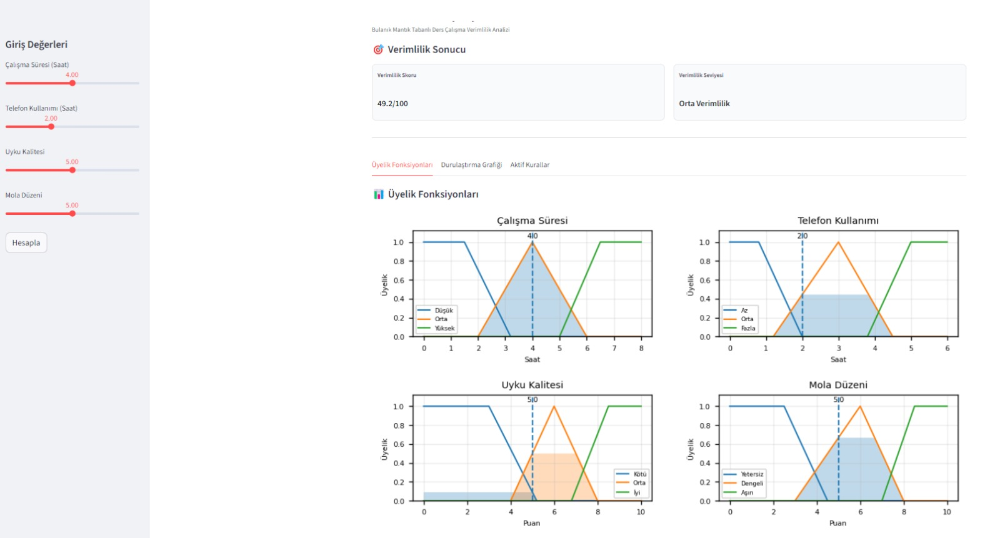
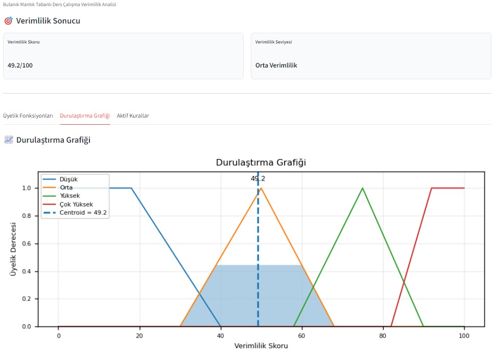
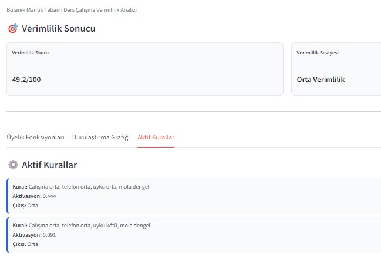
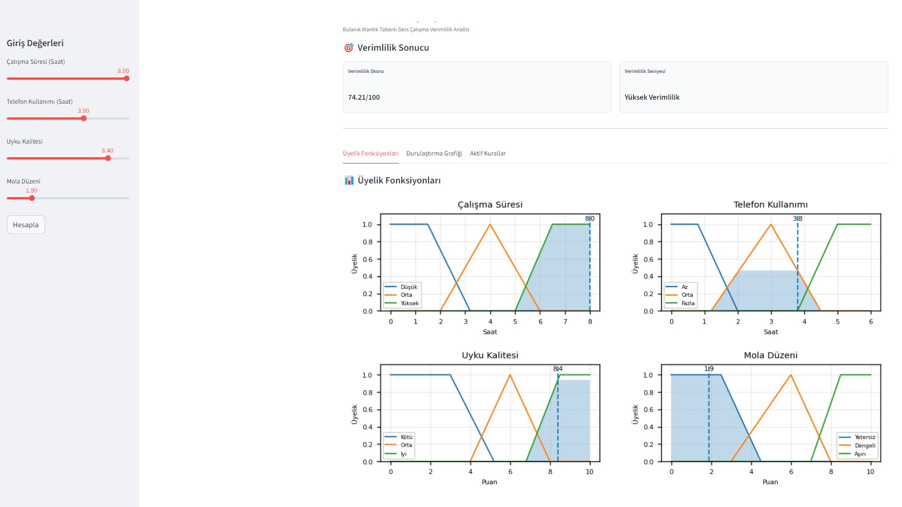
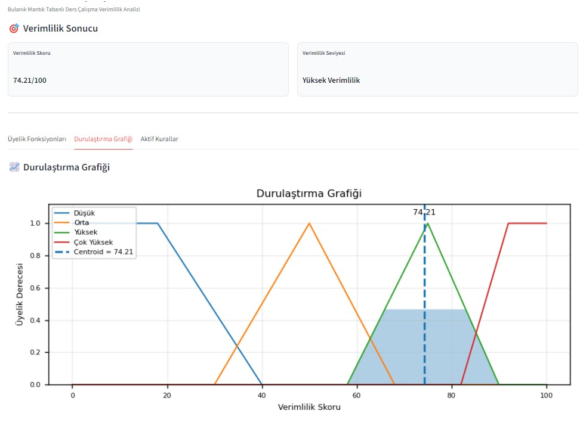
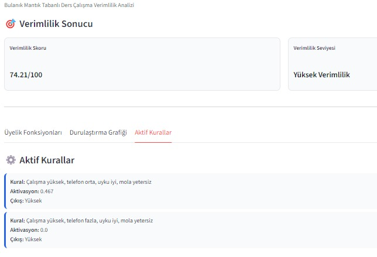
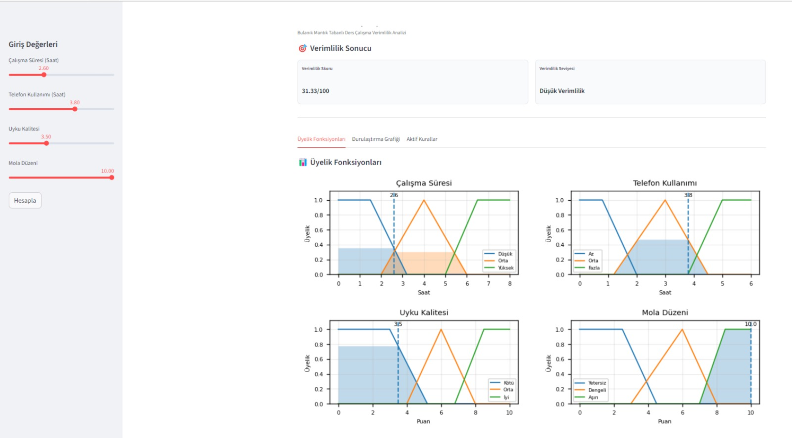
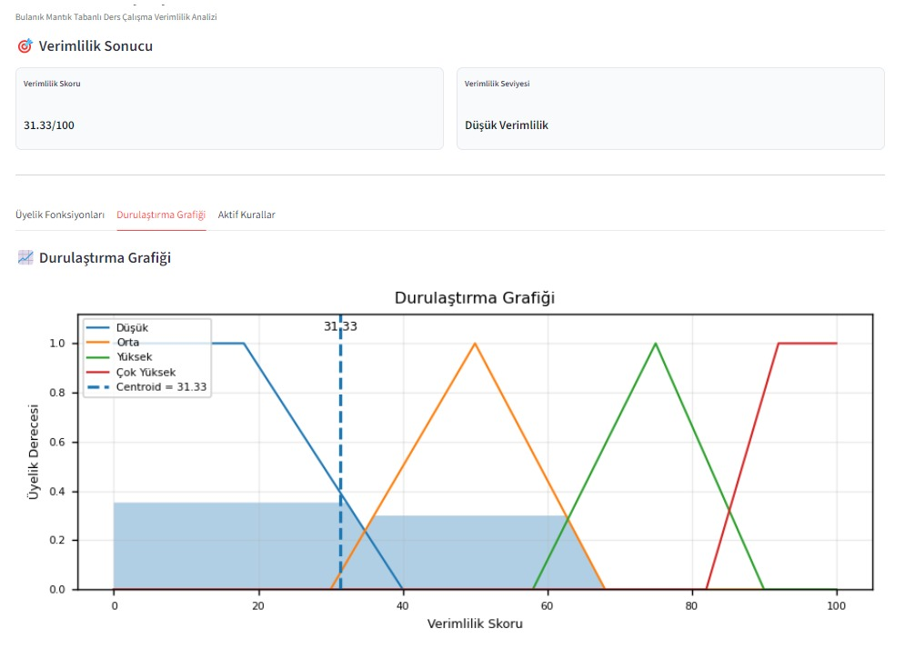
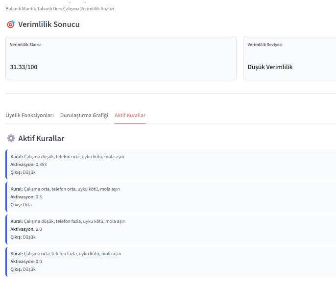

# Akıllı Ders Çalışma Verimlilik Analizi

Bu projede bulanık mantık kullanılarak öğrencilerin ders çalışma verimliliği analiz edilmesi amaçlanmıştır.

Sistem; çalışma süresi, telefon kullanımı, uyku kalitesi ve mola düzeni gibi parametreleri değerlendirerek IF–AND–THEN yapısındaki bulanık kurallar yardımıyla 0-100 arasında bir verimlilik skoru üretmektedir.

Proje içerisinde:

- Mamdani tipi bulanık çıkarım sistemi
- IF–AND–THEN yapısında 18 adet bulanık kural
- Centroid durulaştırma yöntemi
- Üyelik fonksiyonları
- Aktif kural analizi
- Streamlit tabanlı arayüz
- Grafiksel analizler

kullanılmıştır.

---

# Kullanılan Teknolojiler

- Python
- Streamlit
- NumPy
- Matplotlib
- scikit-fuzzy

---

# Sistem Parametreleri

Sistem aşağıdaki giriş değişkenlerini kullanmaktadır:

- Çalışma Süresi (Saat)
- Telefon Kullanımı (Saat)
- Uyku Kalitesi
- Mola Düzeni

Bu parametreler bulanık kümeler yardımıyla değerlendirilerek verimlilik skoru oluşturulmaktadır.

---

# Özellikler

- Mamdani tipi bulanık çıkarım sistemi
- IF–AND–THEN yapısında 18 adet bulanık kural
- Bulanık üyelik fonksiyonları
- Centroid (Ağırlık Merkezi) durulaştırma yöntemi
- Aktif kural analizi
- Grafiksel üyelik fonksiyonları
- Durulaştırma grafikleri
- Etkileşimli Streamlit arayüzü

---

# Kural Tabanı

Sistemde IF–AND–THEN mantığı ile oluşturulmuş toplam 18 adet bulanık kural bulunmaktadır.

Örnek kurallar:

- IF çalışma yüksek AND telefon az AND uyku iyi THEN verimlilik çok yüksek
- IF çalışma yüksek AND telefon orta AND uyku iyi THEN verimlilik yüksek
- IF çalışma düşük AND telefon fazla THEN verimlilik düşük
- IF uyku kötü AND telefon fazla THEN verimlilik düşük
- IF çalışma orta AND telefon orta AND uyku orta THEN verimlilik orta
- IF telefon az AND uyku iyi AND mola dengeli THEN verimlilik çok yüksek

Kuralların aktivasyon değerleri minimum (min) operatörü ile hesaplanmaktadır. Daha sonra Mamdani çıkarım yöntemi uygulanarak aktif kuralların çıkış kümeleri birleştirilmektedir.

---

# Üyelik Fonksiyonları

Aşağıda sistemde kullanılan üyelik fonksiyonları gösterilmektedir.



Bu grafikte giriş değişkenlerinin düşük, orta ve yüksek üyelik kümeleri gösterilmektedir.

Sistem, kullanıcıdan alınan değerleri bu üyelik fonksiyonları üzerinde değerlendirerek bulanık çıkarım işlemini gerçekleştirmektedir.

Taralı bölgeler aktif üyelik derecelerini göstermektedir.

---

# Orta Verimlilik Senaryosu

Bu senaryoda kullanıcı:

- Orta seviyede ders çalışmaktadır
- Telefon kullanım süresi orta seviyededir
- Uyku kalitesi orta düzeydedir
- Mola düzeni dengelidir

Bu değerlere göre sistem yaklaşık 49.2 puan üretmiş ve sonucu "Orta Verimlilik" olarak değerlendirmiştir.

## Orta Verimlilik — Üyelik Fonksiyonları


Bu grafikte kullanıcı giriş değerlerinin hangi üyelik kümelerinde aktif olduğu gösterilmektedir.

Özellikle çalışma süresi ve mola düzeni orta seviyede aktifleşmiştir.

---

## Orta Verimlilik — Durulaştırma Grafiği



Bu grafikte centroid (ağırlık merkezi) yöntemi kullanılarak elde edilen nihai verimlilik sonucu gösterilmektedir.

Mavi taralı alan aktif kümeleri temsil ederken kesikli çizgi hesaplanan centroid sonucunu göstermektedir.

Sonuç yaklaşık 49.2 olarak hesaplanmıştır.

---

## Orta Verimlilik — Aktif Kurallar



Bu senaryoda aktif olan bulanık kurallar sistem tarafından değerlendirilmiştir.

Özellikle çalışma süresi, uyku kalitesi ve mola düzenine bağlı orta seviye kuralların aktif olduğu görülmektedir.

---

# Yüksek Verimlilik Senaryosu

Bu senaryoda kullanıcı:

- Uzun süre ders çalışmaktadır
- Uyku kalitesi yüksektir
- Telefon kullanım süresi kontrollüdür
- Mola düzeni yeterlidir

Bu değerlere göre sistem yaklaşık 74.21 puan üretmiş ve sonucu "Yüksek Verimlilik" olarak değerlendirmiştir.

## Yüksek Verimlilik — Üyelik Fonksiyonları



Bu grafikte çalışma süresi ve uyku kalitesi yüksek kümelerde aktifleşmiştir.

Telefon kullanımının orta seviyede olması sonucu tamamen maksimum değere ulaşmamıştır.

---

## Yüksek Verimlilik — Durulaştırma Grafiği



Durulaştırma grafiğinde centroid yöntemi kullanılarak yaklaşık 74.21 sonucu elde edilmiştir.

Aktif yüksek kümelerin birleşik alanı centroid çizgisi ile gösterilmektedir.

---

## Yüksek Verimlilik — Aktif Kurallar



Bu senaryoda yüksek çalışma süresi ve iyi uyku kalitesine ait kurallar aktif hale gelmiştir.

Sistem yüksek verimlilik sonucu üretmiştir.

---

# Düşük Verimlilik Senaryosu

Bu senaryoda kullanıcı:

- Kısa süre ders çalışmaktadır
- Telefon kullanım süresi yüksektir
- Uyku kalitesi düşüktür
- Mola düzeni aşırıdır

Bu değerlere göre sistem yaklaşık 31.33 puan üretmiş ve sonucu "Düşük Verimlilik" olarak değerlendirmiştir.

## Düşük Verimlilik — Üyelik Fonksiyonları



Bu grafikte düşük çalışma süresi ve kötü uyku kalitesinin aktif olduğu görülmektedir.

Telefon kullanımının fazla olması verimlilik skorunu düşürmektedir.

---

## Düşük Verimlilik — Durulaştırma Grafiği



Durulaştırma sonucunda centroid yöntemi ile yaklaşık 31.33 sonucu elde edilmiştir.

Grafikte düşük kümelerin aktif olduğu açık şekilde görülmektedir.

---

## Düşük Verimlilik — Aktif Kurallar



Bu senaryoda düşük çalışma süresi ve kötü uyku kalitesi ile ilişkili kurallar aktifleşmiştir.

Sistem düşük verimlilik sonucu üretmiştir.

---

# Test ve Değerlendirme

Aşağıda sistem üzerinde gerçekleştirilen bazı test senaryoları verilmiştir.

| Senaryo | Sonuç |
|---|---|
| Orta çalışma + dengeli mola | Orta Verimlilik |
| Uzun çalışma + iyi uyku | Yüksek Verimlilik |
| Kısa çalışma + kötü uyku | Düşük Verimlilik |

Farklı giriş kombinasyonları üzerinde yapılan testlerde sistemin mantıklı ve tutarlı sonuçlar ürettiği gözlemlenmiştir.

---

# Sistemin Güçlü Yönleri

- Gerçek zamanlı analiz yapabilmesi
- Görsel grafik desteği sunması
- Kullanıcı dostu arayüz
- Esnek bulanık mantık yapısı
- Belirsiz durumları daha gerçekçi değerlendirebilmesi
- Aktif kuralların kullanıcıya açık şekilde gösterilmesi

---

# Sistemin Zayıf Yönleri

- Kurallar manuel olarak oluşturulmuştur
- Gerçek kullanıcı verileri ile eğitilmiş bir sistem değildir
- Giriş değişkenleri arttıkça kural sayısı hızla artmaktadır
- Sonuçlar uzman bilgisine dayalıdır

---

# Proje Dosya Yapısı

```text
study_efficiency_fuzzy/
│
├── app.py
├── fuzzy_system.py
├── plots.py
├── test_scenarios.py
├── requirements.txt
├── README.md
│
├── screenshots/
│   ├── medium_membership.png.jpeg
│   ├── medium_defuzzification.png.jpeg
│   ├── medium_rules.png.jpeg
│   ├── high_membership.png.jpeg
│   ├── high_defuzzification.png.jpeg
│   ├── high_rules.png.jpeg
│   ├── low_membership.png.jpeg
│   ├── low_defuzzification.png.jpeg
│   └── low_rules.png.jpeg
```

---

# Projeyi Çalıştırma

## Sanal ortam oluştur

```bash
python -m venv venv
```

## Sanal ortamı aktif et

```bash
.\venv\Scripts\Activate.ps1
```

## Gerekli kütüphaneleri yükle

```bash
pip install -r requirements.txt
```

## Streamlit uygulamasını çalıştır

```bash
streamlit run app.py
```

---

# Sonuç

Bu projede bulanık mantık yaklaşımı kullanılarak öğrencilerin ders çalışma verimliliğini analiz eden kural tabanlı bir karar destek sistemi geliştirilmiştir.

Sistem içerisinde Mamdani çıkarım yöntemi, bulanık üyelik fonksiyonları, IF–AND–THEN kuralları ve centroid durulaştırma yöntemi birlikte kullanılmıştır.

Farklı test senaryolarında sistemin mantıklı ve tutarlı sonuçlar ürettiği gözlemlenmiştir.

Grafiksel analizler sayesinde üyelik fonksiyonları, aktif kurallar ve durulaştırma süreçleri görsel olarak incelenebilmektedir.

---

# Kaynakça

- scikit-fuzzy Documentation
- Streamlit Documentation
- NumPy Documentation
- Matplotlib Documentation
- Bulanık Mantık Ders Notları

---

# Geliştirici

Müsenna Özbek